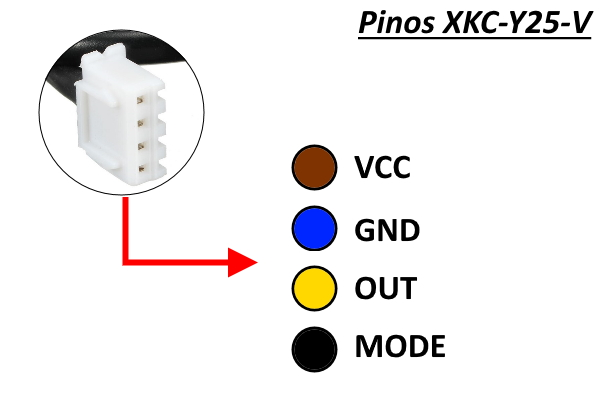

# Sensor de Caixa d'Água WIFI

## Conexão entre o sensor e o ESP-12E.

| ESP8266 | SENSOR BOARD | Descrição                     |
|---------|--------------|-------------------------------|
| VCC     | 1-HV         | 5V para alimentar os sensores |
| D2      | 2-LV1        | Sensor                        |
| D3      | N.C.         | Não conectado                 |
| D4      | N.C.         | Não conectado                 |
| 3v3     | 4-LV         | 3v3 para conversão do sinal   |
| GND     | 5-GND        | Terra comum                   |
| D5      | 3-LV2        | Sensor                        |
| D6      | 6-LV3        | Sensor                        | 
| D7      | 7-LV4        | Sensor                        | 

## Sensor XKC-Y25-NPN

[Datasheet](docs/XKCY25T12V-Datasheet.pdf)

### Pinagem

- VCC - Marrom
- OUT - Amarelo
- GND - Azul
- MODE - Preto

*(considere as cores dos cabos, não confie na posição apresentada na imagem)*

## Platform.io

para build:

> 

### Referências na internet:

[Como usar o sensor de líquido XKC-Y25-V](https://www.arduinoecia.com.br/como-usar-sensor-de-liquido-xkc-y25-arduino/)